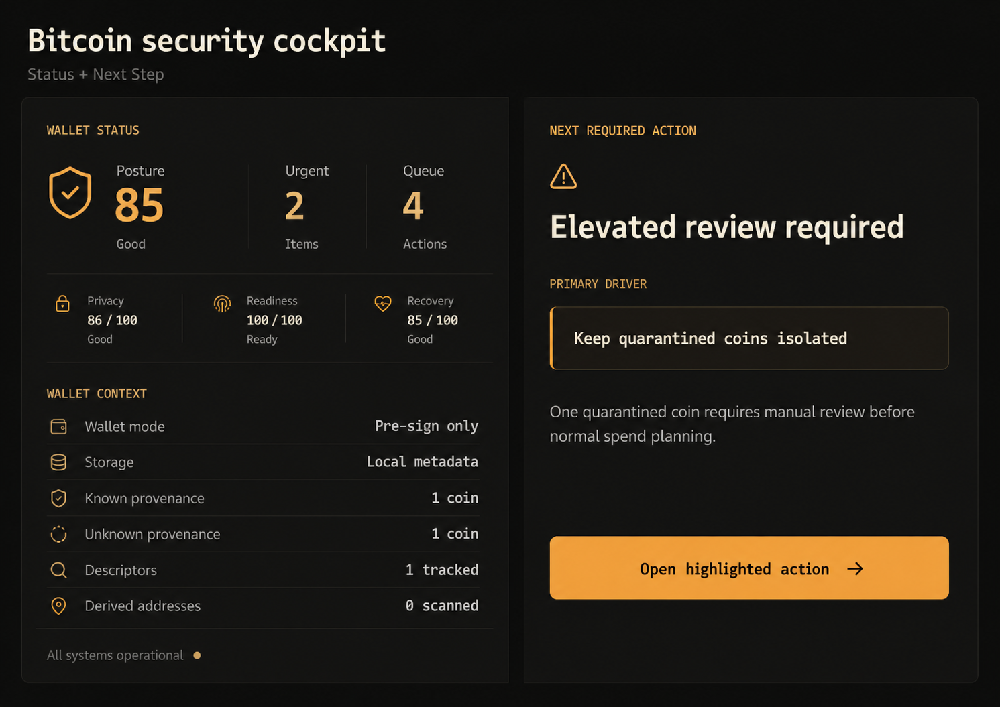

# XpubShield

<p align="center">
  
</p>

## Created by Dylan with Codex GPT-5.5!


XpubShield is a local-first Bitcoin security posture cockpit for watch-only wallet analysis.

It helps operators review wallet posture, coin provenance, spend risk, recovery readiness, backend privacy, and PSBT safety before signing anywhere else.

XpubShield is **pre-sign only**: no private keys, no transaction construction, no signing, no finalization, no extraction, no broadcast, and no custody.



## What It Does

- Reviews watch-only wallet posture
- Helps identify risky coin merges
- Checks recovery metadata
- Reviews PSBTs before signing

## What It Does Not Do

- Does not hold private keys
- Does not build transactions
- Does not sign
- Does not broadcast

## Why It Exists

Bitcoin operations can fail before a signature is produced: unlabeled coins get merged, public backends leak wallet context, recovery metadata goes stale, tiny UTXOs become uneconomical, and PSBTs arrive with risks that are easy to miss.

XpubShield turns watch-only wallet data into evidence-backed actions so operators can make safer decisions before using a wallet or signer.

## Quick Start

Install dependencies:

```bash
npm install
```

Run the browser dev app:

```bash
npm run dev
```

Open the printed Vite URL, usually:

```text
http://localhost:5173
```

Run the desktop app:

```bash
npm run tauri -- dev
```

Build the frontend:

```bash
npm run build
```

Run Rust tests:

```bash
cd src-tauri
cargo test
```

Build the desktop package:

```bash
npm run tauri -- build
```

## Installing Without npm

End users should not need Node, npm, Rust, or the source repo.

For a normal Windows install, share one of the packaged installers from the GitHub Releases page:

- `XpubShield_0.1.3_x64-setup.exe` for a setup wizard
- `XpubShield_0.1.3_x64_en-US.msi` for an MSI installer

For a portable-style run, share:

- `XpubShield_0.1.3_x64-portable.exe`

That executable can be opened directly, but the installer is usually nicer because it creates the standard app install experience. Until the app is code-signed, Windows may show a SmartScreen warning.

To create these files locally, run:

```bash
npm run tauri -- build
```

Tauri writes the generated files under `src-tauri/target/release`. Upload the installer files and `SHA256SUMS.txt` to a GitHub Release instead of committing the binaries to Git.

## Safety Boundary

Never paste or import:

- Seed phrases or mnemonics
- Private keys
- `xprv`, `tprv`, `yprv`, `zprv`, `uprv`, or `vprv` values
- WIF keys
- Hardware wallet PINs, passphrases, or signing-device secrets

The app may process:

- Public descriptors and xpubs
- Derived addresses
- UTXOs and transactions
- Labels, coin sets, provenance notes, and recovery metadata
- PSBT text for local review

Descriptors, xpubs, addresses, labels, transaction history, and PSBTs are still sensitive wallet metadata.

## Core Workflow

1. **Import watch-only data**  
   Load a descriptor, xpub, or demo wallet. Private material is rejected.

2. **Start in Cockpit**  
   Review wallet posture, the top risk driver, and the next required action.

3. **Review coins in Workbench**  
   Label sources, quarantine risky coins, inspect evidence, and save coin sets.

4. **Plan possible spends**  
   Use Spend Preflight before a transaction exists. Pick candidate coins, estimate fee/change, and review privacy or merge risk.

5. **Verify recovery readiness**  
   Use Recovery to check descriptors, fingerprints, paths, gap assumptions, and export readiness.

6. **Review ready-to-sign PSBTs**  
   Use PSBT Preflight after a transaction exists but before signer approval.

## Main Features

- Cockpit risk posture and triage inbox
- Coin Workbench with labels, quarantine state, coin sets, and evidence drawers
- Local provenance heuristics with confidence and evidence
- Spend Preflight for planning coin selection before signing
- Recovery checks and local recovery exports
- PSBT Preflight for local transaction review
- Lineage graph for wallet activity context
- Mock, Bitcoin Core RPC, Electrum, and Esplora-compatible watch-only backends
- Optional tutorial and in-app handbook
- Local persistence for wallet reports, labels, coin sets, alerts, simulations, and workspace state

## Backend Privacy

| Backend | Use case | Privacy posture |
| --- | --- | --- |
| Mock | Demo and UI testing | Local fixture data |
| Bitcoin Core RPC | Local node scans | Best when RPC is local |
| Private Electrum | Script-hash UTXO scans | Good when you control the server |
| Public Electrum | No-node light-client scans | Weak privacy |
| Self-hosted Esplora | Address UTXO scans | Good when you control the server |
| Public Esplora | Emergency/demo lookup | Weak privacy |

Raw xpubs and descriptors should never be sent to third-party APIs. Live backends should query derived addresses or locally derived Electrum script hashes only.

## Storage

Desktop mode stores local data in the operating system app data directory as `xpubshield.sqlite3`.

Use **Settings -> Local exports** to export labels or recovery reports, and **Settings -> Clear local cache** to remove local wallet data from the app.

Protect exported files. They may contain descriptors, addresses, labels, balances, and transaction context.

## Project Layout

- `src/App.tsx`: app shell, navigation, tutorial state, routing
- `src/pages`: main app pages
- `src/components`: shared UI components
- `src/lib`: workflow logic, formatting, workspace persistence
- `src/types/domain.ts`: TypeScript domain models
- `src/api/tauri.ts`: frontend bridge to Tauri commands
- `src-tauri/src`: Rust commands, database, import validation, backend adapters, analysis

## Contributing

Keep changes aligned with the safety boundary:

- Do not add signing, finalization, extraction, or broadcast behavior.
- Do not send raw xpubs or descriptors to third-party APIs.
- Keep sensitive metadata local by default.
- Prefer clear evidence and confidence language over definitive claims.
- Run relevant checks before committing.
