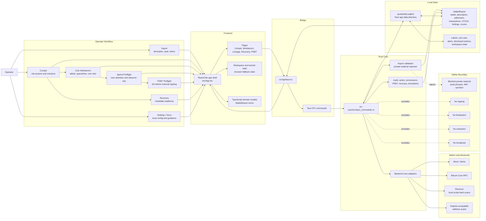

# XpubShield

<p align="center">
  
</p>

## Created by Dylan with Codex GPT-5.5!


XpubShield is a local-first Bitcoin operational security cockpit for watch-only wallet analysis. It helps sovereign operators understand wallet posture, coin provenance, UTXO risk, fee exposure, backend privacy, recovery readiness, and PSBT safety before signing anywhere else. The main workflow is intentionally plain: start in Cockpit, review coins, plan possible spends, verify recovery metadata, and review ready-to-sign PSBTs.

It is intentionally **pre-sign only**: no private keys, no transaction construction, no signing, no finalization, no extraction, no broadcast, and no custody.

## Why It Exists

Bitcoin operations can fail before a signature is ever produced: unlabeled coins get merged, public backends leak wallet context, recovery metadata goes stale, tiny UTXOs become uneconomical, and PSBTs arrive with risks that are easy to miss under pressure.

XpubShield gives operators a dedicated command surface for that pre-sign phase. It turns watch-only wallet data into evidence-backed actions, so coin decisions are made from posture, provenance, and privacy context instead of guesswork.

## Current Status

XpubShield is under active development. It is suitable for demo workflows and controlled operator evaluation, but it should not be treated as stable production software yet.

Current strengths:

- Local desktop app built with Tauri, React, TypeScript, Rust, and SQLite.
- Watch-only descriptor/xpub import with private-material rejection.
- Demo wallet for safe evaluation without real wallet metadata.
- Mock, Bitcoin Core RPC, Electrum, and Esplora-compatible scanning modes.
- Network Lock for opt-in local-only import safety rails.
- Local provenance, risk scoring, action ranking, labels, coin sets, recovery checks, PSBT analysis, and packaged desktop builds.
- Guided workflow panels and tutorial copy that explain when to use Spend Preflight, PSBT Preflight, and Recovery.

Not stable-release ready yet:

- SQLite metadata is not encrypted.
- Live backend monitoring is not a full background indexer.
- Bitcoin Core and Esplora support are address-scan oriented and should be tested carefully with real infrastructure.
- Electrum support is one-shot and TCP-only in this pass; TLS, Tor, and proxy routing are deferred.
- A fresh watch-only security review should happen before a stable release.

## Safety Boundary

XpubShield is designed for sensitive wallet metadata, not signing material.

Never paste or import:

- Seed phrases or mnemonics
- Private keys
- `xprv`, `tprv`, `yprv`, `zprv`, `uprv`, or `vprv` values
- WIF keys
- Hardware wallet PINs, passphrases, or signing-device secrets

The app may process:

- Public descriptors
- Public extended keys such as xpubs
- Derived addresses
- UTXOs and transactions
- Labels, coin sets, provenance notes, and recovery metadata
- PSBT text for local analysis

Descriptors, xpubs, addresses, labels, transaction history, and PSBTs are still sensitive. They can reveal wallet structure, balances, future receive addresses, and operational context.

## Core Capabilities

### Cockpit

The Cockpit is the primary command surface. It summarizes wallet risk posture, the top risk driver, confidence, affected coins, and the safest next action.

- Risk-led landing page focused on wallet status and the next required action
- Prioritized Action Center / triage inbox for the highest-impact items
- Mission Queue for guided operations
- Local alert signals folded into the command surface
- Compact posture instruments for privacy, recovery, spend readiness, backend privacy, balance, and provenance

### Coin Workbench

Coin Workbench turns raw UTXOs into operational decisions.

- Search, filter, sort, and inspect UTXOs
- Label coins and source context
- Mark spendability and quarantine status
- Save named coin sets with intent and notes
- Review states such as ready, review, quarantine, do not merge, and label needed
- Open detail drawers with provenance evidence, spend costs, wallet path, transaction context, and related risks

### Provenance Intelligence

XpubShield explains where coins may have come from using local evidence.

- Manual source labels and categories
- Bundled registry/demo heuristics
- Wallet-change and unknown-source heuristics
- Confidence levels and evidence history
- Clear "heuristic, not definitive" product stance

No remote chain-surveillance attribution service is used.

### Spend Preflight

Spend Preflight is for planning a possible spend before a transaction exists. It models what an observer could learn if selected coins are spent together.

- Selected coin workflow
- Destination amount and fee-rate inputs
- Change policy modeling
- Common-input ownership warnings
- KYC/non-KYC and provenance mixing analysis
- Toxic change and quarantine exposure checks
- Safer alternative suggestions
- Optional local simulation persistence
- Guided "what / when / next" panel that keeps the workflow distinct from PSBT review

Spend Preflight does not construct, sign, or broadcast transactions.

### Transaction Lineage

Lineage gives an interactive graph view of wallet activity and coin context.

- Lineage map
- Wallet graph
- UTXO lifecycle view
- Label clusters
- Privacy-risk graph
- Fee heatmap
- Pan and zoom controls
- Selected-node detail panel

### Recovery

Recovery helps operators verify whether watch-only metadata is complete enough to restore or independently verify the wallet view under pressure.

- Descriptor completeness checks
- Fingerprint and derivation-path review
- Change descriptor coverage
- Gap-risk signals
- Multisig metadata readiness where available
- Local recovery report export
- Descriptor diff access for ambiguous descriptor or xpub identity checks

### PSBT Preflight

PSBT Preflight is for reviewing a ready-to-sign transaction before signer approval.

- Local PSBT parsing/linting
- Fee and input/output risk checks
- Quarantined-input warnings
- Change and descriptor-context review
- Input/output detail sections that expand when PSBT data is present
- No signing, finalization, extraction, or broadcast

### Import and Backends

The import flow accepts descriptor or xpub watch-only data.

- Descriptor and xpub import modes
- Network selection
- Gap limit control
- Mock backend for demo workflows
- Local Bitcoin Core RPC backend
- Private Electrum light-client backend
- Public Electrum mode with explicit script-hash privacy acknowledgement
- Self-hosted Esplora-compatible backend
- Public Esplora mode with explicit privacy acknowledgement
- Network Lock that restricts future imports to mock/offline mode or localhost Bitcoin Core RPC
- Browser demo fallback when Tauri IPC is unavailable

### Operator Support and Local Persistence

XpubShield keeps operator guidance and wallet context close to the work.

- Optional Sovereign Ops tutorial
- Tutorial starts after import/demo at Cockpit, explains the Spend Preflight / Recovery / PSBT distinction, and returns to Cockpit when finished
- In-app Documentation tab
- Bitcoin primer
- Operator test script
- Local wallet reports, labels, coin sets, alerts, spend simulations, consolidation simulations, and workspace state
- SQLite storage in the platform app data directory as `xpubshield.sqlite3`

## Architecture



### Frontend

- React 18
- TypeScript
- Vite
- Lucide icons
- Tauri API bridge

Key areas:

- `src/App.tsx`: app shell, sidebar navigation, tutorial state, workspace restore, module routing
- `src/pages`: primary app pages
- `src/components`: shared UI components
- `src/lib`: formatting, workflow logic, workspace persistence, local scenario helpers
- `src/types/domain.ts`: TypeScript mirror of Rust domain models

### Backend

- Rust
- Tauri commands
- SQLite via `rusqlite`
- Descriptor parsing and derivation via `miniscript`
- Local mock, Bitcoin Core, Electrum, and Esplora-style backend modules

Key areas:

- `src-tauri/src/tauri_commands.rs`: commands exposed to the frontend
- `src-tauri/src/database.rs`: SQLite migrations and persistence
- `src-tauri/src/wallet_import.rs`: descriptor/xpub import validation
- `src-tauri/src/electrum_backend.rs`: Electrum script-hash scanning
- `src-tauri/src/provenance_engine.rs`: local provenance assessment
- `src-tauri/src/action_engine.rs`: Cockpit action ranking
- `src-tauri/src/psbt_linter.rs`: local PSBT analysis
- `src-tauri/src/recovery_report.rs`: recovery posture checks

## Quick Start

### Prerequisites

Install these before running from source:

- Node.js 20 or newer
- npm
- Rust stable with Cargo
- Tauri platform dependencies for your operating system

On Windows, install Rust with rustup:

```powershell
winget install Rustlang.Rustup
rustc --version
cargo --version
```

If `cargo` is not found after installation, close and reopen PowerShell.

### Clone and Install

```bash
git clone https://github.com/dboyza/XpubShield.git
cd XpubShield
npm install
```

### Browser Development Mode

```bash
npm run dev
```

Open the printed Vite URL, usually:

```text
http://localhost:5173
```

Browser mode is useful for UI development and demo workflows. Some desktop features depend on Tauri IPC and local SQLite, so the app will show a browser-demo notice when those features are unavailable.

### Desktop Development Mode

```bash
npm run tauri -- dev
```

Use this mode when testing desktop persistence, local app data paths, Tauri commands, and packaged-app behavior.

### Build

Frontend build:

```bash
npm run build
```

Rust tests:

```bash
cd src-tauri
cargo test
```

Desktop package from the repository root:

```bash
npm run tauri -- build
```

On Windows, successful packaging creates artifacts similar to:

```text
src-tauri/target/release/xpubshield.exe
src-tauri/target/release/bundle/msi/XpubShield_0.1.0_x64_en-US.msi
src-tauri/target/release/bundle/nsis/XpubShield_0.1.0_x64-setup.exe
```

## Operator Workflow

### 1. Start with the Demo Wallet

Use the demo wallet before importing real watch-only data.

1. Open the app.
2. Go to **Import**.
3. Select **Demo wallet**.
4. Review the Cockpit risk posture and Mission Queue.

### 2. Import Watch-Only Data

Use a public descriptor when possible. Bare xpub import is supported, but descriptors carry richer script and origin metadata.

1. Go to **Import**.
2. Choose **Descriptor** or **Xpub**.
3. Select the network and backend.
4. Set the gap limit.
5. Acknowledge public backend privacy warnings if using public Esplora or public Electrum.
6. Import and scan.

### 3. Triage in Cockpit

Start every session from Cockpit.

1. Read the Risk Posture panel first.
2. Review the top risk driver and confidence.
3. Open the suggested next step.
4. Work through the Action Center and Mission Queue.

### 4. Review Coins in Workbench

Use Coin Workbench to turn raw UTXOs into operational decisions.

1. Search and filter UTXOs.
2. Label known sources.
3. Mark suspicious or unknown coins for review or quarantine.
4. Save coin sets for later preflight review.
5. Open evidence drawers before clearing risk states.

### 5. Plan a Possible Spend

Use Spend Preflight before a transaction is built or signed elsewhere:

1. Select candidate coins.
2. Enter the destination amount.
3. Choose a fee rate and change policy.
4. Read observer inferences and warning evidence.
5. Adjust the coin group before using an external wallet or signer.

### 6. Verify Recovery Readiness

Use Recovery to confirm the watch-only view can be restored or independently verified.

1. Review backup readiness.
2. Export Markdown or JSON recovery notes to storage you control.
3. Use descriptor diff if descriptor or xpub identity feels ambiguous.
4. Resolve missing descriptor, fingerprint, path, gap, or export metadata.

### 7. Review Ready-to-Sign PSBTs

Use PSBT Preflight after a wallet or coordinator creates a PSBT, but before signer approval.

1. Paste a base64 or hex PSBT, or load the local example fixture.
2. Review the transaction summary, fee, inputs, outputs, and change detection.
3. Open warning evidence and resolve issues before signing elsewhere.
4. Remember that a clean lint result is useful, but it does not prove a transaction is safe.

## Backend Privacy

| Backend | Use case | Privacy posture |
| --- | --- | --- |
| Mock | Demo and UI testing | Local fixture data |
| Bitcoin Core RPC | Local node scans | Best when RPC is local |
| Private Electrum | One-shot script-hash UTXO scans | Good when you control the server |
| Public Electrum | No-node light-client scans | Weak privacy; script-hash queries can reveal wallet activity |
| Self-hosted Esplora | Address UTXO scans | Good when you control the server |
| Public Esplora | Emergency/demo lookup | Weak privacy; requires acknowledgement |

Raw xpubs and descriptors should never be sent to third-party APIs. Live backends should query derived addresses or locally derived Electrum script hashes only.

## Storage and Privacy

The desktop app stores local data in the operating system app data directory. Use **Settings -> Local exports** to export labels or recovery reports, and **Settings -> Clear local cache** to remove local wallet data from the app.

Protect exported files. They may contain wallet metadata, labels, descriptors, addresses, and transaction context.

Browser development mode may use local browser storage for demo reports, tutorial state, mission queue state, and workspace resume state. Desktop mode uses Tauri and SQLite for durable app data.

## Verification

Recommended checks before sharing a build:

```bash
npm run build
cd src-tauri
cargo test
cd ..
npm run tauri -- build
```

Recommended smoke test:

- Fresh launch opens Import.
- Demo wallet loads.
- Cockpit Risk Posture is the first obvious read.
- Mission Queue can collapse and reopen.
- Tutorial begins at Cockpit, explains Spend Preflight / Recovery / PSBT usage, and returns to Cockpit after Finish.
- Coin Workbench filters, selected coins, and drawers behave correctly.
- Spend Preflight selections and scenario inputs persist after reload and clearly stay in planning mode.
- Lineage pan/zoom works.
- Documentation is searchable and includes the operator script.
- Recovery and PSBT Preflight render without console errors and explain when to use each workflow.
- Clear local cache removes wallet/workspace state.

## Limitations

- XpubShield is not a wallet and cannot spend Bitcoin.
- SQLite metadata is not encrypted yet.
- Public backend use can leak address or script-hash query metadata.
- Live backend coverage is not a complete wallet monitor.
- Electrum scanning is one-shot and TCP-only; TLS, Tor, proxy routing, and background monitoring are not implemented yet.
- Very large wallet graphs are bounded in-app and may need a dedicated graph engine later.
- Provenance assessment is heuristic and local; it is not definitive counterparty attribution.

## Roadmap

Near-term priorities:

- Fresh watch-only security review
- Better live backend transaction history
- Electrum TLS/Tor/proxy support
- Background scan scheduling
- Encrypted local database option
- More robust large-wallet graph handling
- Richer import diagnostics for ambiguous xpub paths
- Expanded operator test scripts

## Contributing

This repository is still early. Keep changes aligned with the safety boundary:

- Do not add signing, finalization, extraction, or broadcast behavior.
- Do not send raw xpubs or descriptors to third-party APIs.
- Keep sensitive metadata local by default.
- Prefer clear evidence and confidence language over definitive claims.
- Run the build and Rust tests before committing.
